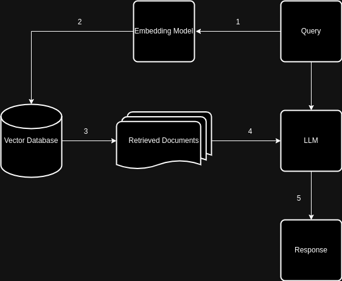
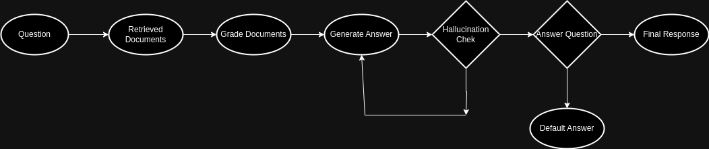

# Biology Concepts Chatbot

This repository contains the source code and implementation details for a chatbot that answers questions from the first two chapters of the book "Concepts of Biology" using Retrieval-Augmented Generation (RAG) methodology.

## Solution Architecture

The chatbot solution is built using the following components:

- **Backend API (FastAPI Microservice):**

  - Implements logic for Simple RAG and Advanced RAG.
  - Exposes APIs for querying and interacting with the chatbot.

- **WebUI (Streamlit App):**

  - Provides a user-friendly interface for interacting with the chatbot.
  - Allows users to select between Simple RAG and Advanced RAG modes.
  - Requires input of the LLM model server URL and backend API URL.

- **LLM Model Server:**
  - Hosts Large Language Models (LLMs) as an API using tools like Ollama.
  - Handles question answering based on provided context and query.

## RAG Architectures

### Simple RAG

- Utilizes "nomic-embed-text" model for document embeddings.
- Stores embeddings in a vector database (e.g., Chroma) for efficient retrieval.
- Retrieves relevant documents and passes them as context to LLM for response generation.



### Advanced RAG (CRAG + Adaptive RAG)

- Retrieves documents and grades relevance to user queries.
- Filters out irrelevant documents and sends relevant ones to LLM.
- Evaluates LLM response for hallucinations and relevance to the query.



## Steps to Run

1. **Start LLM Server:**

   - Launch the LLM server on Google Colab or Kaggle GPU using "ollama_host.ipynb".
   - Copy the LLM server URL for later use.

2. **Pull Necessary Models:**

   - Download and set up required models (e.g., "llama3", "nomic-embed-text") on the LLM server.

3. **Run Backend API:**

   - Start the FastAPI app using the following command:
     ```bash
     uvicorn app:app --reload
     ```

4. **Run Streamlit WebUI:**

   - Launch the Streamlit app with:
     ```bash
     streamlit run streamlit_app
     ```
   - Open the Streamlit UI in a web browser.

5. **Configure Streamlit UI:**
   - Enter the LLM server URL and the FastAPI backend URL in the Streamlit UI.
   - Start chatting with the chatbot based on the provided documents.

## To-Dos

- Implement text ROI detection to handle infographics and noise during document chunking.
- Explore alternative text splitting techniques (e.g., Semantic Chunking, Agentic Chunking) for improved document processing.
- Evaluate RAG flow using modules like ragas for context recall, precision, answer relevance score, and faithfulness with prepared ground truth data.
- Adding conversational memory.
